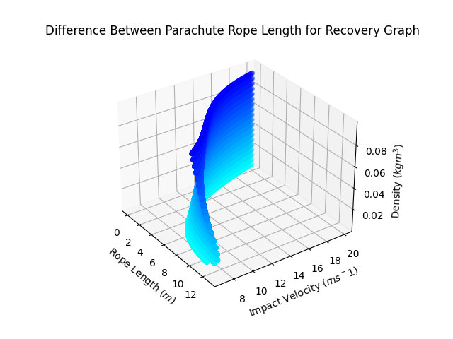

# SRP Rocket Recovery Simulations
Simulations for single-parachute-dual-rope rocket recovery.


## Dynamic Rope Mass Landing Simulation
Plot the length of rope by which the main rocket body should extend past the nosecone to approximate the impact velocity experienced by the nosecone (and thus payload inside) after the main body lands (at higher impact velocity).



## Rope-Mass-Negligible Simulation
Similar, but mass of rope is negligible allowing the simulation to run significantly faster. However, some precision is lost.

## How to run
Run the following commands in your terminal:
```shell
$ git clone git@github.com:stasostyk/SRP-Rocket-Recovery-Simulations.git
$ cd SRP-Rocket-Recovery-Simulations
$ pip install -r requirements.txt
```
Then simply run the file with:
```shell
$ py dynamic_mass_landing_simulation.py
```

### Parameters
Here are some useful parameters you can pass along to customize the simulation to your needs.

```shell
$ py dynamic_mass_landing_simulation.py --ask
```

To prompt for input parameters rather than using hard-coded values (for rapid changes).

```shell
$ ... --3D
```
To render a 3D model instead.

```shell
$ ... --3D-time
```
To render a 3D model with the z-axis as time, and density denoted by colour.

```shell
$ ... --isolate 0.05
```
To isolate a specific density and only display it (works in combination with all other features!).

```shell
$ ... -dt 0.1 # use a time-step of 0.1 instead
```
To edit the time-step. Warning: should be under 1s.

Here is an example of timestep 0.1 versus 0.05:


